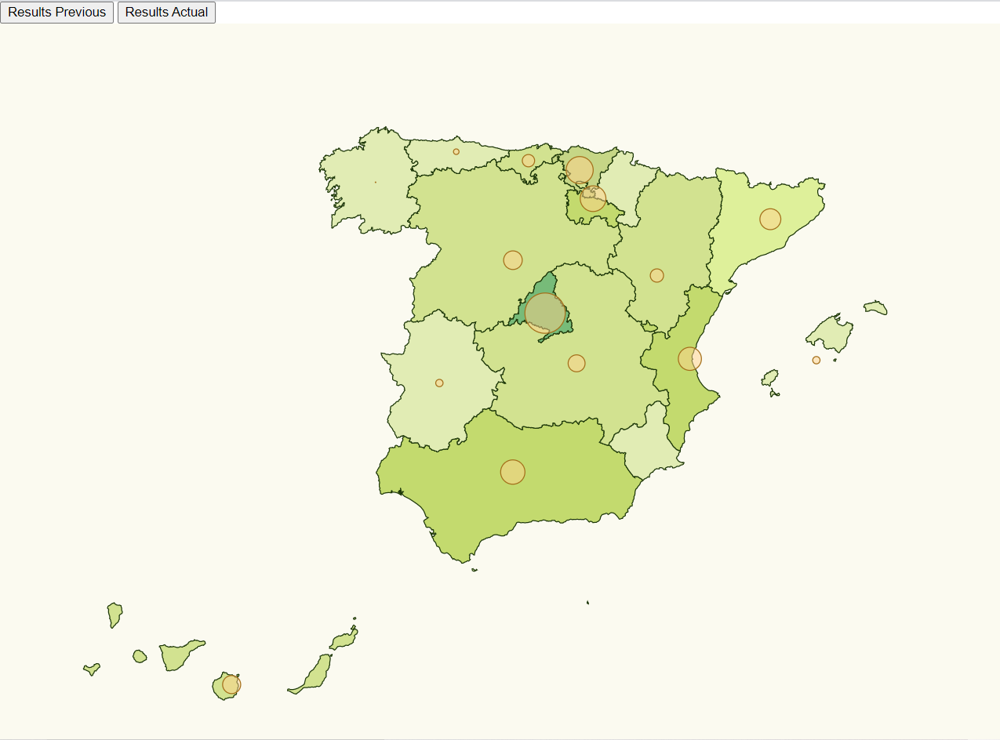

# Multiple Series with Background Scale

In this challenge we want to obtain something like this:




# Steps

- We will take as starting example the first task _Data_Visualization_Task1_, let's copy the content from that folder and execute _npm install_.

```bash
npm install
```

- Now we have to implement a chart that colours each community of Spain depending on how heavy they have been affected by Coronavirus.
- If we check the values they start from 0 to 3000 approx, let's assign a range of colors for that domain:

_./src/index.ts_

```diff
// set the affected color scale
const color = d3
  .scaleThreshold<number, string>()
  .domain([0, 10, 20, 30, 40, 50, 150, 200, 500, 800, 3000])
  .range([
    "#FFFFF",
    "#e1ecb4",
    "#d2e290",
    "#def09a",
    "#c3da6e",
    "#c6d686",
    "#A6D480",
    "#77BB79",
    "#49A173",
    "#0D876B",
    "#006358",
  ]);
```

- Let's create a help function to map from community to color.

_./src/index.ts_

```diff
const assignCommunityBackgroundColor = (comunidad: string,
                                      stats: ResultEntry[]) => {
  const item = stats.find(
    (item) => item.name === comunidad
  );
  return item ? color(item.value) : color(0);
};
```

- Finally it is time to change the updateChart because in this case we need that the colour of the communities changes depending on the stats.
- It is necessary to remove the path because without this step we couldn't change the path from the given one firstly. Then we color the path with _assignCommunityBackgroundColor_:

_./src/index.ts_

```diff
const updateChart = (stat: ResultEntry[]) => {
  console.log("updating")
  svg.selectAll("path").remove();
  svg.selectAll("circle").remove();
  svg.selectAll("path")
  .data(geojson["features"])
  .enter()
  .append("path")
  .attr("class", "country")
  // data loaded from json file
  .attr("d", geoPath as any)
  .style("fill", function (d: any) {
    return assignCommunityBackgroundColor(d.properties.NAME_1, stat);
  });
  svg
    .selectAll("circle")
    .data(latLongCommunities)
    .enter()
    .append("circle")
    .attr("class", "affected-marker")
    .attr("r", (d) => calculateRadiusBasedOnAffectedCases(d.name, stat))
    .attr("cx", (d) => aProjection([d.long, d.lat])[0])
    .attr("cy", (d) => aProjection([d.long, d.lat])[1]);
};
```

- Moreover, it is necessary that the communities have the same name in the three files: _stats.ts_, _spain.json_ and _communities.ts_. For that reason we have changed the names of the communities in the file _spain.json_, for having the same names than in the other two:


_./src/spain.json_

```diff
Comunidad de Madrid -> Madrid
Castilla-La Mancha -> Castilla La Mancha
Comunidad Foral de Navarra -> Navarra
Comunidad Valenciana -> Valencia
Principado de Asturias -> Asturias
Región de Murcia -> Murcia
```

